# Kangalos Project Management Platform - System Diagrams

## 1. System Context Diagram

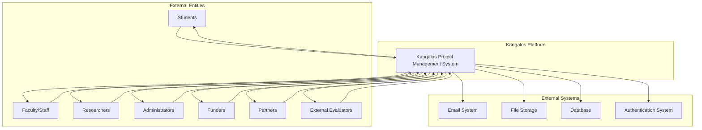

## 2. High-Level Use Case Diagram

```mermaid
graph TB
    subgraph "Kangalos System"
        subgraph "Project Management"
            UC1[Submit Project Proposal]
            UC2[Review Project]
            UC3[Approve/Reject Project]
            UC4[Track Project Progress]
            UC5[Submit Project Reports]
        end

        subgraph "Funding Management"
            UC6[Request Funding]
            UC7[Approve Funding]
            UC8[Track Fund Usage]
            UC9[Receive Installments]
        end

        subgraph "User Management"
            UC10[Register User]
            UC11[Assign Roles]
            UC12[Manage Permissions]
        end

        subgraph "Reporting & Analytics"
            UC13[Generate Reports]
            UC14[View Dashboard]
            UC15[Export Data]
        end
    end

    Student((Student)) --> UC1
    Student --> UC4
    Student --> UC5

    Faculty((Faculty)) --> UC1
    Faculty --> UC2
    Faculty --> UC4
    Faculty --> UC5

    Evaluator((Evaluator)) --> UC2
    Evaluator --> UC3

    Admin((Administrator)) --> UC10
    Admin --> UC11
    Admin --> UC12
    Admin --> UC13
    Admin --> UC14

    Funder((Funder)) --> UC6
    Funder --> UC7
    Funder --> UC8
    Funder --> UC9

    Researcher((Researcher)) --> UC1
    Researcher --> UC4
    Researcher --> UC5
    Researcher --> UC6
```

## 3. User Journey - Project Submission Flow

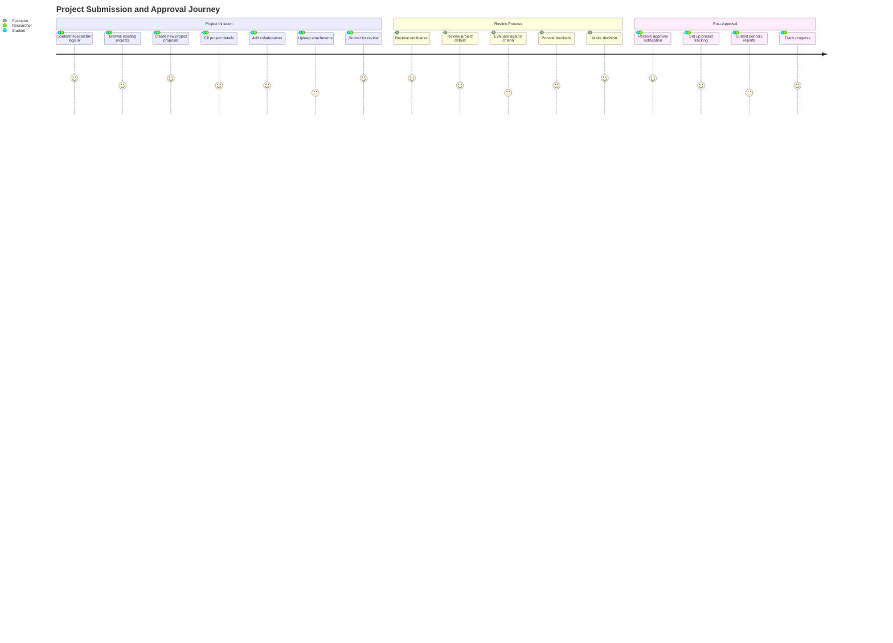

## 4. Data Flow Diagram - Project Lifecycle

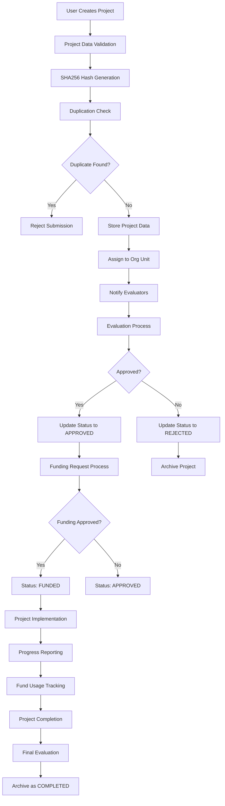

## 5. User Role and Permission Flow

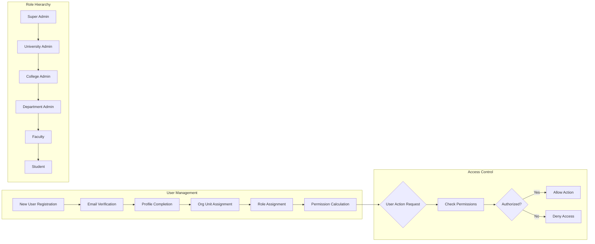

## 6. Funding Process Flow

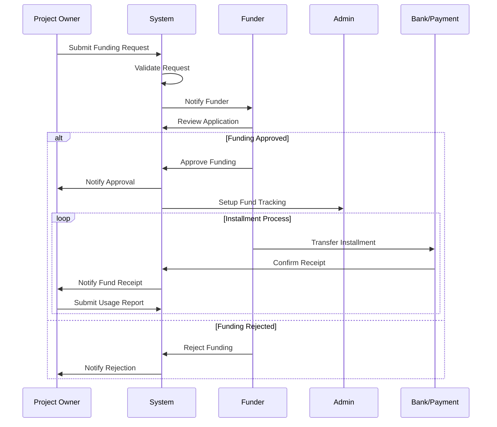

## 7. Project Status State Machine

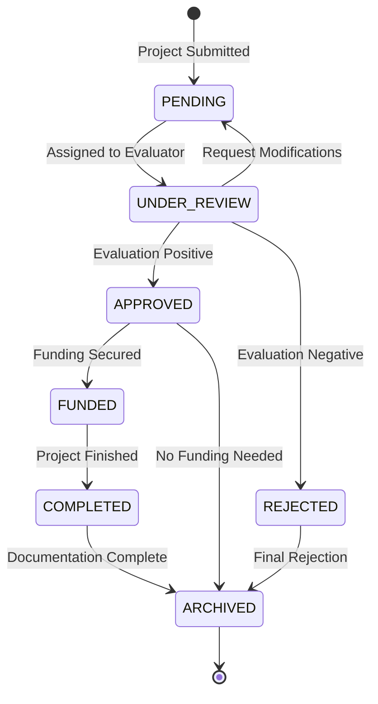

## 8. Organizational Hierarchy and Project Flow

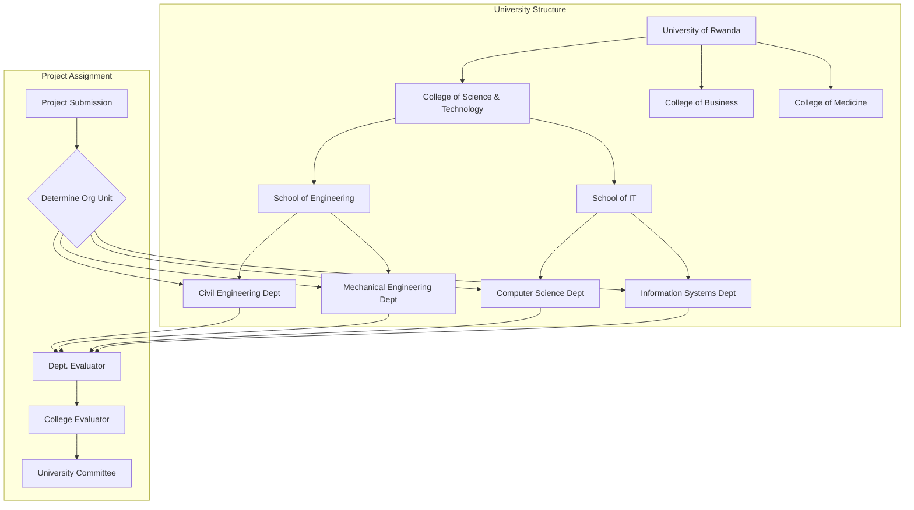

## 9. Stakeholder Interaction Diagram

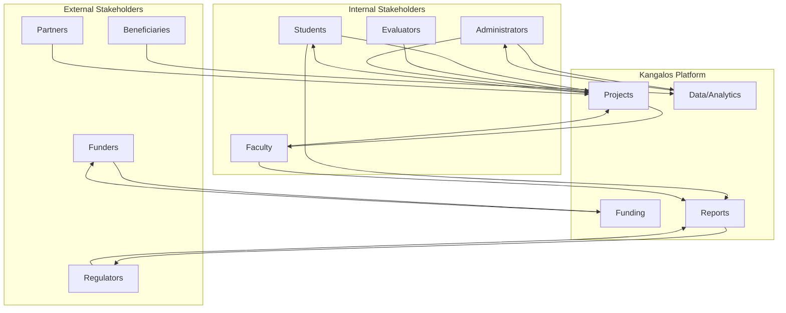

## 10. Document and File Management Flow

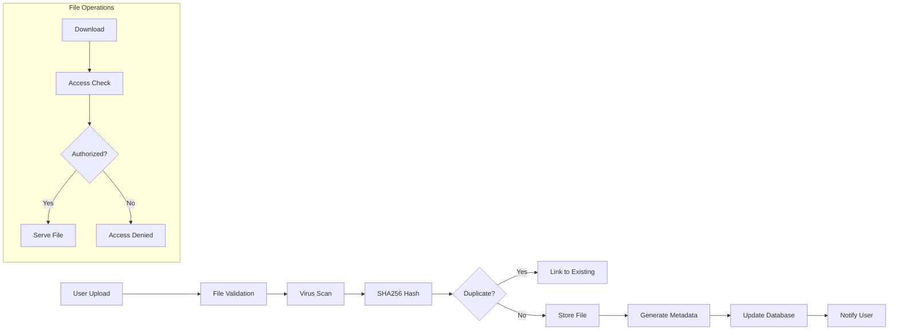

## 11. Reporting and Analytics Flow

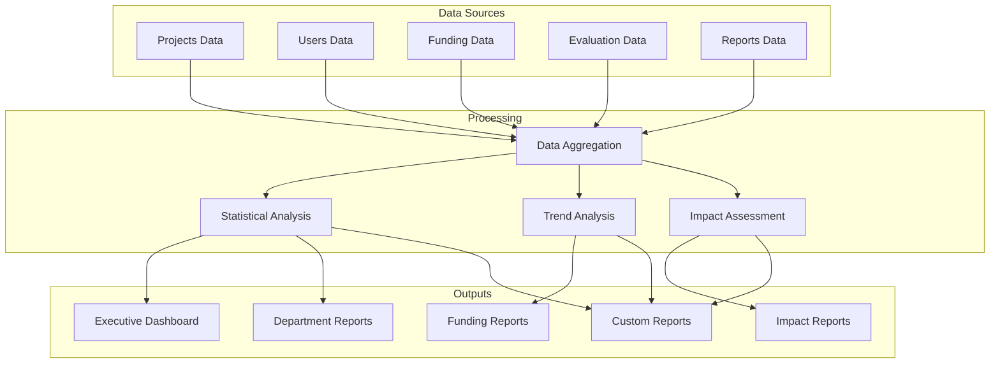

## 12. Project Evaluation Workflow

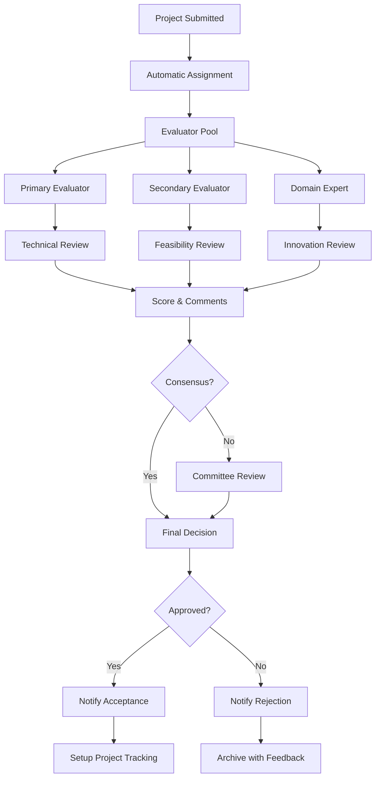

## 13. User Authentication and Authorization Flow

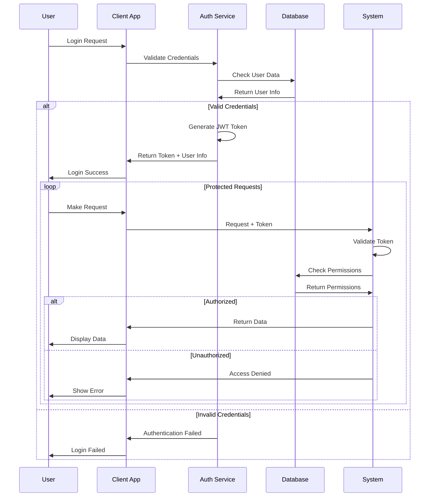

## 14. Project Collaboration and Communication Flow

```mermaid
graph TB
    subgraph "Project Team"
        A[Lead Author]
        B[Co-Authors]
        C[Supervisors]
        D[External Partners]
    end

    subgraph "Communication Channels"
        E[Project Updates]
        F[Status Changes]
        G[Evaluation Results]
        H[Funding Notifications]
        I[Report Submissions]
    end

    subgraph "Notification Methods"
        J[Email Alerts]
        K[Dashboard Notifications]
        L[SMS (Critical)]
        M[System Messages]
    end

    A --> E
    B --> E
    C --> F
    D --> E

    E --> J
    F --> K
    G --> J
    G --> K
    H --> J
    H --> L
    I --> M

    J --> A
    J --> B
    J --> C
    J --> D
    K --> A
    K --> B
    K --> C
    L --> A
    M --> A
    M --> B
    M --> C
```

## 15. Integration and External System Flow

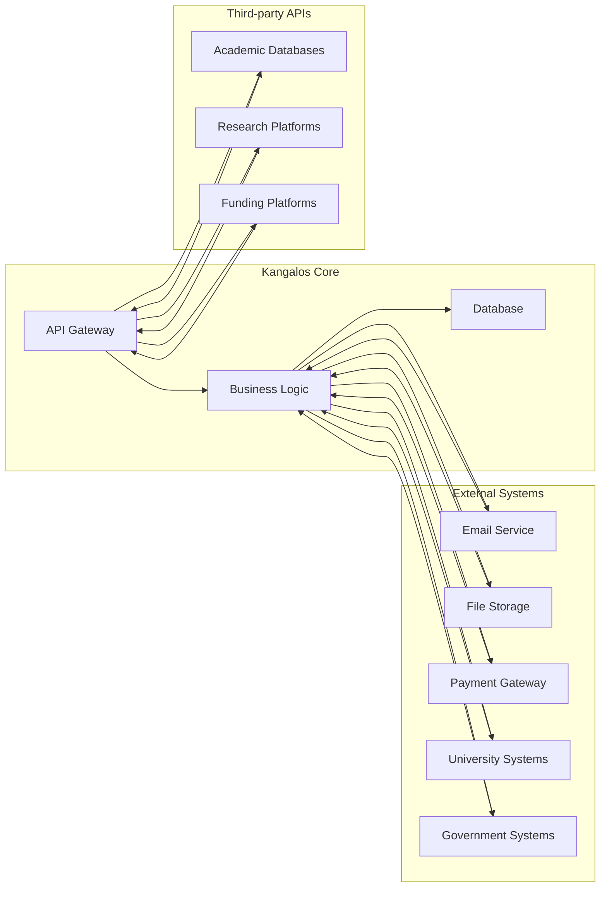

## 16. Complete Application Flow - Sequence Diagram

```mermaid
sequenceDiagram
    participant U as User
    participant W as Web App
    participant A as Auth Service
    participant P as Project Service
    participant E as Evaluation Service
    participant F as Funding Service
    participant N as Notification Service
    participant D as Database
    participant S as File Storage

    Note over U,S: 1. USER REGISTRATION & AUTHENTICATION
    U->>W: Access Platform
    W->>A: Request Registration
    A->>D: Create User Record
    A->>N: Send Verification Email
    N->>U: Email Verification Link
    U->>A: Verify Email
    A->>D: Activate User Account

    Note over U,S: 2. USER LOGIN & PROFILE SETUP
    U->>W: Login Request
    W->>A: Validate Credentials
    A->>D: Check User & Permissions
    D->>A: Return User Data & Roles
    A->>W: Return JWT Token + Profile
    W->>U: Dashboard Access Granted

    U->>W: Complete Profile
    W->>P: Update User Info
    P->>D: Store Profile Data
    P->>W: Profile Updated
    W->>U: Profile Complete

    Note over U,S: 3. PROJECT CREATION FLOW
    U->>W: Create New Project
    W->>P: Request Project Form
    P->>D: Get Categories & Templates
    D->>P: Return Form Data
    P->>W: Project Form
    W->>U: Display Form

    U->>W: Submit Project Data
    W->>P: Validate Project
    P->>P: Generate SHA256 Hash
    P->>D: Check Duplicates

    alt Project is Duplicate
        D->>P: Duplicate Found
        P->>W: Duplicate Error
        W->>U: Show Duplicate Warning
    else Project is Unique
        D->>P: No Duplicates
        P->>D: Store Project
        P->>W: Project Created
        W->>U: Success Message
    end

    Note over U,S: 4. FILE ATTACHMENT FLOW
    U->>W: Upload Attachments
    W->>S: Store Files
    S->>P: Return File URLs
    P->>D: Link Files to Project
    P->>W: Attachments Saved
    W->>U: Upload Complete

    Note over U,S: 5. PROJECT SUBMISSION & EVALUATION
    U->>W: Submit for Review
    W->>P: Submit Project
    P->>D: Update Status to PENDING
    P->>E: Request Evaluation
    E->>D: Find Available Evaluators
    E->>N: Notify Evaluators
    N->>E: Send Email Notifications

    Note over E: Evaluator Reviews Project
    E->>W: Access Evaluation Portal
    W->>E: Load Project Details
    E->>D: Get Project Data
    D->>E: Return Project Info
    E->>W: Display Project
    W->>E: Evaluation Interface

    E->>W: Submit Evaluation
    W->>E: Process Evaluation
    E->>D: Store Evaluation Results
    E->>P: Update Project Status

    alt Project Approved
        P->>D: Set Status to APPROVED
        P->>N: Notify Success
        N->>U: Approval Email
    else Project Rejected
        P->>D: Set Status to REJECTED
        P->>N: Notify Rejection
        N->>U: Rejection Email with Feedback
    end

    Note over U,S: 6. FUNDING REQUEST FLOW
    alt Project Needs Funding
        U->>W: Request Funding
        W->>F: Create Funding Request
        F->>D: Store Funding Data
        F->>N: Notify Funders
        N->>F: Send Funder Notifications

        Note over F: Funder Reviews Request
        F->>W: Access Funding Portal
        W->>F: Load Funding Request
        F->>D: Get Project & Financial Data
        D->>F: Return Complete Info
        F->>W: Display Funding Details

        F->>W: Make Funding Decision
        W->>F: Process Decision

        alt Funding Approved
            F->>D: Approve Funding
            F->>P: Update Project Status to FUNDED
            F->>N: Notify Approval
            N->>U: Funding Approved Email

            loop Installment Payments
                F->>D: Record Installment
                F->>N: Notify Payment Received
                N->>U: Payment Notification
                U->>W: Submit Usage Report
                W->>F: Store Usage Data
                F->>D: Update Fund Tracking
            end

        else Funding Rejected
            F->>D: Reject Funding
            F->>N: Notify Rejection
            N->>U: Funding Rejected Email
        end
    end

    Note over U,S: 7. PROJECT IMPLEMENTATION & TRACKING
    U->>W: Update Project Progress
    W->>P: Store Progress Data
    P->>D: Update Progress Metrics
    P->>W: Progress Saved
    W->>U: Update Confirmed

    loop Periodic Reporting
        U->>W: Submit Progress Report
        W->>P: Process Report
        P->>D: Store Report Data
        P->>N: Notify Stakeholders
        N->>P: Send Update Notifications
    end

    Note over U,S: 8. PROJECT COMPLETION
    U->>W: Mark Project Complete
    W->>P: Finalize Project
    P->>D: Update Status to COMPLETED
    P->>E: Request Final Evaluation
    E->>D: Store Final Assessment
    E->>P: Complete Evaluation
    P->>D: Archive Project
    P->>N: Notify Completion
    N->>U: Project Completion Email

    Note over U,S: 9. REPORTING & ANALYTICS
    U->>W: Access Reports Dashboard
    W->>P: Get Analytics Data
    P->>D: Query Aggregated Data
    D->>P: Return Statistics
    P->>W: Format Report Data
    W->>U: Display Dashboard

    Note over U,S: 10. SYSTEM ADMINISTRATION
    alt Admin Functions
        U->>W: Admin Actions
        W->>A: Verify Admin Permissions
        A->>D: Check Role Permissions
        D->>A: Confirm Admin Access
        A->>W: Grant Admin Access

        U->>W: Manage Users/Roles
        W->>A: Update User Management
        A->>D: Modify User Data
        A->>N: Notify Changes
        N->>A: Send Admin Notifications
    end
```

## Summary

These diagrams provide a comprehensive view of the Kangalos Project Management Platform, covering:

1. **System Context** - How the platform fits in the broader ecosystem
2. **Use Cases** - What users can do with the system
3. **User Journeys** - Step-by-step user experiences
4. **Data Flow** - How information moves through the system
5. **Process Flows** - Business process automation
6. **State Management** - Project lifecycle states
7. **Organizational Structure** - University hierarchy mapping
8. **Stakeholder Interactions** - Who interacts with whom
9. **Technical Flows** - System-level processes
10. **Integration Patterns** - External system connections

Each diagram serves a specific purpose in explaining the system to different audiences, from executive stakeholders to technical implementers.
